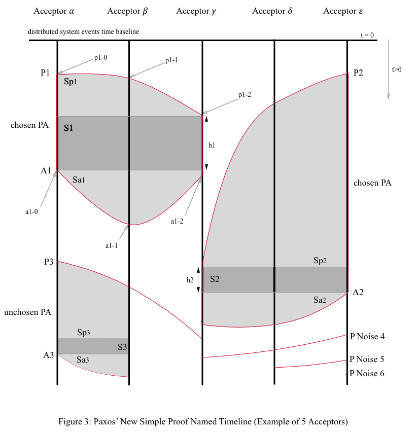
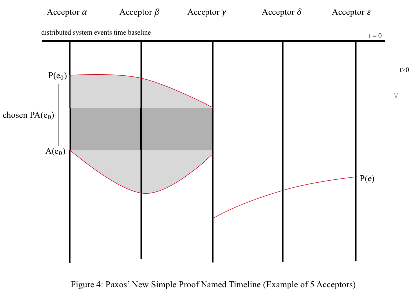
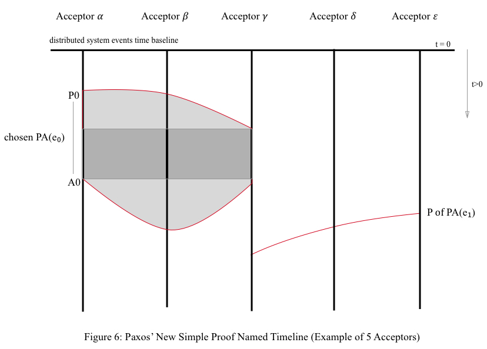

## Paxos Made Easy: The Geometric Meaning and Geometric Proof of Paxos Algorithm

## Paxos Made Easy: Paxos算法的几何意义与证明

Here is the [English Version](README_en.md) of this paper.

----


本文是开源项目[TuringCell](https://turingcell.org)的一个子项目。Turing Cell Model是一个运行于分布式一致性算法(如Paxos/Raft)之上的计算机模型，TuringCell是一个Turing Cell Model的开源实现，这意味着您可以毫不费力地为已有的软件增加高可用、容错、强一致等等分布式系统的特性。同时，TuringCell是一个商业友好的开源项目，它的核心力量源泉是一个开放包容的开源社区，不管您来自哪里，说什么语言，都可以加入进来一起平等自由地讨论、构建TuringCell！

作者：Sen Han (韩森) 00hnes@gmail.com

# Table of Content

   * [0 摘要](#0-摘要)
   * [1 前言](#1-前言)
   * [2 认识Paxos](#2-认识Paxos)
      * [2.1 系统假定](#21-系统假定)
      * [2.2 场景定义](#22-场景定义)
      * [2.3 Acceptor定义](#23-Acceptor定义)
      * [2.4 Proposer定义](#24-Proposer定义)
   * [3 几何意义与证明](#3-几何意义与证明)
      * [3.1 定义](#31-定义)
      * [3.2 定理](#32-定理)
      * [3.3 数学证明](#33-数学证明)
      * [3.4 几何证明](#34-几何证明)
      * [3.5 琐碎事项](#35-琐碎事项)
   * [4 总结](#4-总结)
   * [5 数学证明背后的哲学意义](#5-数学证明背后的哲学意义)
   * [6 社区、支持与合作](#6-社区支持与合作)
   * [7 捐赠](#7-捐赠)
   * [8 更新历史](#8-更新历史)
   * [9 Copyright and License](#9-copyright-and-license)

### 0 摘要

本文描述了Paxos算法的几何意义，并在此基础上提出了一种新的名为“分布式时间线图法”的Paxos严格数学证明方法，这是一种非常简单、形象的数学证明方法。本文中的实际证明部分篇幅很短，绝大部分内容都是在尝试严格清晰地定义到底什么是Paxos算法，所以，本文同时也是一份十分适合新手的Paxos算法的学习资料。

### 1 前言

计算机科学领域中有很多非常经典的算法，但有些可能会给很多人一种感觉，这甚至包括了一些图灵奖算法，那就是“如果我处于当时那个计算机发展的新生时期，面对这样要解决的问题，我也能想出类似的精彩的解法出来”。但是Paxos算法绝对不在此列。

令人难以想象的是，如此简洁、优美、精炼的Paxos算法却解决了分布式系统中最麻烦、最棘手的问题之一，同时它的数学证明也非常的巧妙，充满美感，令人陶醉不能自已，就像无意中对一位拥有绝世容颜的女子的匆匆一瞥，终其一生，不能忘怀，也无法忘怀。

Paxos算法本身非常简单，它在实际应用中的优化也非常的直接--只要满足了它所需要的基本约束，我们就可以在此之上随意地定制，以优化它在实际应用中的性能表现。
但是，要准确无误地在工程上实现一个算法，就必须要完全理解、必须要能够独立严格熟悉地用理性与逻辑去证明这个算法，甚至最好还要对这个算法有一定直观的、形象的理解，否则在处理各种异常情况和针对特殊场景进行定制优化时就必然会一知半解、迷迷糊糊，这样的情形下，要保证bugfree，就只能焚香祷祝、听天由命了，当然，前提是如果设计者在乎它的正确性的话。这也是本文之所以产生的原因之一。

尽管Paxos算法如此简洁、易证明，为什么还是会有很多人认为Paxos算法晦涩难懂呢？我认为有如下两个主要原因：

1. 分布式系统本身固有的内在复杂性。单机系统运行模型的复杂性与分布式系统运行模型的复杂性根本不可同日而语。可以认为这是一种“[涌现](https://zh.wikipedia.org/zh/%E6%B6%8C%E7%8E%B0)”现象。

2. 很多向初学者讲述Paxos算法原理与证明的资料总是倾向于从比较感性、模糊、甚至类比的角度去讲解Paxos，作者认为这样有时反而容易会让事情变得更糟。就像学习数学最好的方式就是把书中所有的定理都从头到尾独立地推导证明一遍，而非去死记公式，因为只靠死记公式只会让数学更加显得晦涩难懂、深奥无比。Paxos算法虽然很简洁，但绝对不简单，要准确地理解Paxos算法的第一步就是用严格的数学描述去定义Paxos算法，即定义清楚一个数学问题，当一个问题的定义非常清晰且没有歧义之后，我们才能说自己真正明白了这个要解决的问题到底是什么，接着，其证明才有可能出现。

如果您已经非常熟悉Paxos算法并且能够熟练地证明它，您可以直接阅读本文的[第三章](#3-几何意义与证明)。

如果您现在还不能够独立熟练地证明Paxos算法，即使您现在很熟悉Paxos算法的流程，也应该从头到尾仔细地阅读本文。

因为，如果不能够熟练严谨地证明Paxos算法的正确性，几乎就不可能完全真正地理解Paxos的算法流程和一些它隐含的必要约束条件，也就很难在应用中去准确无误地优化和定制Paxos算法。所以，本文不只是一个证明而已，开头的大部分内容都是在对Paxos算法做一个精确的工程描述，如果您发现描述中和您之前所理解的有所不同，那很好，因为这往往就是问题所在。在认真读完本文的第一遍之后，如果没有达到目标，请再次完整地读一遍本文，如果在第二次读完之后仍然没有达到目标，您可以整理好您的疑惑和问题发邮件给我，我一定会尽快地回复。 

**本文所有的讨论均建立在“系统中不存在[拜占庭错误](https://zh.wikipedia.org/wiki/%E6%8B%9C%E5%8D%A0%E5%BA%AD%E5%B0%86%E5%86%9B%E9%97%AE%E9%A2%98)”这一前提之下。**

本文在[此仓库中](https://github.com/turingcell/paxos-made-easy)进行版本控制，热烈欢迎新的Issue和PR : )

### 2 认识Paxos

#### 2.1 系统假定

一般常见的分布式系统运行模型的假定：

> &emsp;A0.1&emsp;Processors operate at arbitrary speed
>
> &emsp;A0.2&emsp;Processors may experience failures
>
> &emsp;A0.3&emsp;Processors with stable storage may re-join the protocol after failures
>
>&emsp;A0.4&emsp;Processors do not collude, lie, or otherwise attempt to subvert the protocol. That is, Byzantine failures don't occur
>
>&emsp;A0.5&emsp;Processors can send messages to any other processor
>
>&emsp;A0.6&emsp;Messages are sent asynchronously and may take arbitrarily long to deliver
>
>&emsp;A0.7&emsp;Messages may be lost, reordered, or duplicated
>
>&emsp;A0.8&emsp;Messages are delivered without corruption. That is, Byzantine failures don't occur
>
>&emsp; -- https://en.wikipedia.org/wiki/Paxos_(computer_science)#Assumptions

我们将上面陈述中的假定A0.7替换为A0.9即得到本文中所默认的系统假定

&emsp;**A0.9**&emsp;**Messages may be lost, reordered, but will never be duplicated**

即本文所默认的系统假定不包含“message duplication”情形。尽管是显而易见、且非必要的，本文最终仍然将“message without duplication”情形下的Paxos证明进一步推广到了“message with duplication”的一般分布式系统假定之中。更多细节陈述见[章节3.5](#35-琐碎事项)。

#### 2.2 场景定义


在上图中，描绘了一个由五个Acceptor和任意多个Proposer组成的Paxos运行实例。在 *t=0* 时刻，所有Acceptor均处于初始状态。

其中，Acceptor是Paxos运行实例的一种关键组成角色，一个Paxos运行实例包含一个固定的Acceptor集合，这个Acceptor的集合信息我们称之为一个Paxos运行实例的*配置*：


对于只有一个Acceptor的Paxos运行实例，其配置可以写成如下：


上图中的Paxos运行实例的配置可以写为：


系统在任何情况下，都会满足如下约束

&emsp;&emsp;**约束0.1**&emsp;**一个Paxos运行实例有且只有一个固定不变的配置**

在上图中，系统时间 *t<0* 时，系统创建了一个Paxos运行实例，其配置被设为*config0*（永远不变）;在 *t=0* 时刻，所有的Acceptor均已完成初始化并且可以向外提供服务。

另外，在一个Paxos运行实例中不但包含了一组固定不变的Acceptor角色（即一个Paxos实例的固定配置），还包括了另外一种名为Proposer的角色，它的数量没有任何限定。Proposer可以看成是访问Acceptor服务的客户端，在 *t>0* 时，Proposer在遵守Paxos算法流程的前提下向*Paxos配置*中的Acceptor们发送名为*Prepare*和*Accept*的两种请求。

#### 2.3 Acceptor定义

每一个处于正常状态的Acceptor都会维护一个被持久存储的状态表 *t*，以Acceptor0为例，状态表 *t* 的格式和初始值如下

```lua
-- initial value of t
local t = { 
    id  = "acceptor0", -- constant
    cfg = config0,     -- config of paxos
    p_e = 0,           -- prepare_epoch
    a_e = 0,           -- accept_epoch
    a_v = nil          -- accept_value
}
```

* 成员*id*表示此Acceptor的身份，它是只读不可更改的；
* 成员*cfg*的值是此Paxos实例的配置值，它是只读不可更改的；
* 成员*p_e*是一个非负的、可拥有任意精度的整数，它的初值是0；
* 成员*a_e*是一个非负的、可拥有任意精度的整数，它的初值是0；
* 成员*a_v*是一个可拥有任意长度的二进制字符串，它的初值是空值*nil*。

Acceptor向Proposer提供两种RPC服务，Prepare（简称P操作）和Accept（简称A操作）。

```lua
P(e) -> { true, t.p_e, t.a_e, t.a_v } || { false, t.p_e }
```

```lua
-- serve input RPC: P(e)
local function acceptor_prepare_srv(e)
    byzantine_assert( t.p_e >= 0 and t.p_e >= t.a_e )
    if e > t.p_e then
        t.p_e = e
        must_success_fsync_t()
        return { true, t.a_e, t.a_v }
    else
        return { false, t.p_e }
    end
end
```

当Acceptor收到 _P(e)_ 请求时，将会调用函数 _acceptor\_prepare\_srv(e)_ 进行处理并且返回响应。

其中，*byzantine\_assert* 我们称之为拜占庭错误检测，它会进行一些程序基本逻辑的错误检测，如果发现错误，它将会通知Paxos配置集合里所有的Acceptor立即停机，由于Paxos算法正确的前提条件之一就是系统中不存在拜占庭错误，那么显然此时的系统再运行下去已经没有了任何意义，反而可能会造成更严重的问题。正常情况下这些逻辑判定永远都是真值，除非程序本身拥有严重的bug或者计算机在运行期间得到了错误的计算结果，其更加精确详细的定义和讨论可以参考[拜占庭将军问题](https://zh.wikipedia.org/wiki/%E6%8B%9C%E5%8D%A0%E5%BA%AD%E5%B0%86%E5%86%9B%E9%97%AE%E9%A2%98)和[拜占庭Paxos算法](https://lamport.azurewebsites.net/tla/byzsimple.pdf)。拜占庭错误检测并不属于Paxos算法的一部分，所以如果您愿意的话，在本文的阅读中可以直接忽略它。

函数 *must\_success\_fsync\_t* 负责将Acceptor的状态表*t*持久存储到磁盘中，只有当此函数正确执行之后才会进行后续的请求结果返回流程；如果函数执行失败，Acceptor将会直接异常退出。

**_P(e)_ 的语义:**

&emsp;**Acceptor收到 *P(e)* 请求后，先判断条件 *e > t.p\_e* 是否为真**

&emsp;&emsp;**• 为真，执行赋值语句 *t.p\_e = e* 更新状态表*t*，然后将*t*持久存储，最终返回 _\{ true, t.a\_e, t.a\_v \}_**

&emsp;&emsp;**• 为假，则返回 _\{ false, t.p\_e \}_**

&emsp;**若一个Acceptor同时收到多个P(e)请求，Acceptor保证对各个P(e)请求的服务处理之间都是严格串行、原子独立的**

```lua
A(e,v) -> { true } || { false, t.p_e }
```

```lua
-- serve input RPC: A(e,v)
local function acceptor_accept_srv(e,v)
    byzantine_assert( t.p_e >= 0 and t.p_e >= t.a_e and e <= t.p_e )
    if e == t.p_e then
        if e == t.a_e then
            byzantine_assert(t.a_v == v)
            return { true }
        else
            t.a_e = e
            t.a_v = v
            must_success_fsync_t()
            return { true }
        end
    else
        return { false, t.p_e }
    end
end
```

当Acceptor收到*A(e,v)* 请求时，将会调用函数*acceptor\_accept\_srv* 进行处理并且返回响应。

**_A(e,v)_ 的语义:**

&emsp;**Acceptor收到 *A(e,v)* 请求之后，判断条件 *e == t.p\_e***

&emsp;&emsp;**• 为真，判断条件 *e == t.a\_e***

&emsp;&emsp;&emsp;**・ 为真，执行 *byzantine\_assert(t.a\_v == v)* ，返回 _\{ true \}_**

&emsp;&emsp;&emsp;**・ 为假，执行赋值语句 *t.a\_e = e* 和 *t.a\_v = v* ，接着持久存储*t* ，最后返回 *\{ true \}***

&emsp;&emsp;**• 为假，返回 _\{ false, t.p\_e \}_**

&emsp;**若一个Acceptor同时收到多个 _A(e,v)_ 请求，Acceptor保证对各个 _A(e,v)_ 请求的服务处理之间都是严格串行、原子互斥的**

对于外部的请求者来说，一个Acceptor共有以下三种状态：

1. 未知：网络不可达、超时等等；
2. 正常服务：请求被正确处理并且能够得到一个有效的返回值；
3. 不可用：服务未上线或者已经**死亡**等等。


其中，当一个Acceptor服务出现了永久性的、不可逆的损坏，比如状态表*t*的持久存储磁盘文件发生了不可恢复的损坏或者文件丢失等等情况时，我们称此Acceptor已经死亡，**已经死亡的Acceptor将永远处于死亡状态**，是无法被“复活”的。

同时，每一个Acceptor都必须满足如下约束

&emsp;&emsp;**约束0.2**&emsp;**每一个Acceptor对服务请求（_P(e)_ 或者 _A(e,v)_ ）的处理在时间上两两之间是原子互斥的**

#### 2.4 Proposer定义

```lua
proposer_propose(v, e) -> {chosen_flag, help_chosen_flag, chosen_v, next_e}
```

```lua
local majorityN = (len(config0) + 2) / 2
local function proposer_propose(v, e)
    local p_next_e, p_ok_list, max_a_v = send_prepare_to_majority(e)
    if len(p_ok_list) >= majorityN then
        local accept_v = v
        local help_flag = false
        if max_a_v ~= nil then  
            accept_v = max_a_v
            help_flag = true
        end
        local a_ok_list, a_next_e = send_accept_to(p_ok_list, e, accept_v)
        if len(a_ok_list) >= majorityN then
            return {true, help_flag, accept_v, nil}
        else
            return {false, false, nil, a_next_e or p_next_e}
        end
    else
        return {false, false, nil, p_next_e}
	end
end
```

其中，*majorityN*的定义为：

&emsp;对于拥有𝑥个成员的非空集合𝐀（𝐀内所有成员各不相同），存在正整数𝑦满足条件

&emsp;&emsp;任意两个拥有𝑦个成员的𝐀子集，它们之间一定存在一个非空交集

&emsp;𝐀的最小𝑦取值则定义为*majorityN*.

例如，一个集合内部有三个成员，那么*y*的取值可以是2或者3，则最小的*y*取值即*majorityN*为2。更多的例子如下：

・当*x=1,y=1*，则*majorityN=1*；

・当*x=2,y=2*，则*majorityN=2*；

・当*x=3,y=2,3*，则*majorityN=2*；

・当*x=4,y=3,4*，则*majorityN=3*；

・当*x=5,y=3,4,5*，则*majorityN=3*；

・当*x=6,y=4,5,6*，则*majorityN=4*；

**… …**

```LUA
send_prepare_to_majority(e) -> p_next_e, p_ok_list, max_a_v
```

函数 *send\_prepare\_to\_majority(e)* 向Paxos配置中大于等于 *majorityN* 个（后简称“多于半数的”）Acceptor每人发送一个 _Prepare(e)_ 请求，函数返回值的定义为：

* *p\_ok\_list*是所有对*Prepare(e)* 返回了成功（即返回了*true*）的Acceptor列表；
* *max\_a\_v*是在所有的*Prepare(e)* 成功返回值中拥有**最大非零*t.a\_e*的返回值**的*t.a\_v*值，若不存在，返回*nil*；
* *p\_next\_e*是一个用于优化Proposer性能的建议序号值，一般取值为所有*Prepare(e)* 返回值中最大的*t.p\_e*值再加一，若不存在，返回*nil*。它的取值不会影响到Paxos算法的正确性，但是可能会对Paxos算法的运行性能起到一定的影响。

```lua
send_accept_to(p_ok_list, e, v) -> a_ok_list, a_next_e
```

函数 *send\_accept\_to(p\_ok\_list, e, v)* 向所有已经Prepare成功了的Acceptor（即入参*p\_ok\_list*中所有的Acceptor）每人发送一个 _Accept(e,v)_ 请求，函数返回值的定义为：

* *a\_ok\_list*为Acceptor集合 *p\_ok\_list* 中向请求 *Accept(e,v)* 返回了操作成功的Acceptor列表；
* *a\_next\_e* 是一个用于优化Proposer性能的建议值，一般取值为所有 *Accept(e,v)* 返回值中最大*t.p\_e*值再加一，若不存在，返回*nil*。它的取值不会影响到Paxos算法的正确性，但是可能会对Paxos算法的运行性能起到一定的影响。

```lua
proposer_propose(v, e) -> {chosen_flag, help_chosen_flag, chosen_v, next_e}
```

**函数 *proposer\_propose(v, e)* 的每一次调用都应该看成是一个独一无二的Proposer的创建、运行与结束，即一个Proposer的完整生命周期。**

函数 *proposer\_propose(v, e)* 发起一次值为 *v* 的议案提交，其中入参*e*是用于优化Proposer性能的一个拥有任意精度的、默认值为1的正整数，函数的返回值定义为：

* *chosen\_flag*是一个bool值，若为真，表示一个议案被chosen（即“选定了”），否则表示当前Proposer认为本次议案的提交是失败的（如果有些A操作的返回值在网络中丢失，那么即使议案真的被chosen了，Proposer也会认为它的这次议案提交是失败的）
* *help\_chosen\_flag*是一个bool值，只有在返回值*chosen\_flag*为真时才有意义
  * 若*chosen\_flag*为真且*help\_chosen\_flag*为真：最终被chosen的议案*chosen\_v*值是之前其它的Proposer所提交的，即帮助其它的某个Proposer选定了一个提案*chosen\_v*值，而不是选定了函数入参中指定的议案*v*
  * 若*chosen\_flag*为真且*help\_chosen\_flag*为假：最终被chosen的议案*chosen\_v*值是函数入参中的议案*v*，即此次chosen的议案是调用此函数的Proposer自己提交
* *chosen\_v*为一个任意长度的二进制字符串，表示被chosen的议案值，如果不存在，返回*nil*；
* *next\_e*是一个用于优化Proposer性能的建议*e*值，主要用于函数*proposer\_propose*的迭代调用中，用法如下：


```lua
local function must_chosen(v)
    local e = 1
    while true do
        local chosen_flag, help_chosen_flag, chosen_v, next_e =
            proposer_propose(v,e)
        if chosen_flag then
            return help_chosen_flag, chosen_v
        end
        e = next_e		
    end
end
```

### 3 几何意义与证明

#### 3.1 定义




图2说明了图3的生成过程，图3是一个拥有五个Acceptor的Paxos运行实例的**分布式时间线图**（后简称为时间线图），已知在 *t = 0* 时刻，所有的Acceptor均已完成了初始化并且可以对所有Proposer角色提供Prepare和Accept请求的服务。

在时间线图中，最上面一条横线为 *t = 0* 系统起始线，下方五条竖线分别为各个Acceptor的**时间线**，所有时间线上的时间刻度相同，即任意一条水平线 *t = 𝑥* 与所有Acceptor时间线的五个水平交点皆表示为对应Acceptor时间线上在 *t = 𝑥* 时刻的点。

为了方便后续的描述，接下来进行一些术语的定义。

**P**即Prepare操作，**A**即Accept操作，**接下来只要没有特指，P或A指的都是获得了成功响应的Prepare或Accept操作**。

**P噪音**(P Noise)指的是，Proposer通过调用函数 *send\_prepare\_to\_majority(e)* 向Acceptor们发送 *P(e)* 请求并在Acceptor上操作成功的那些P操作，并且后续此Proposer并没有使用此*e*值进行 *A(e, v)* 成功过（比如可能是因为P成功响应的个数没有大于等于*majorityN*，或者Proposer发生了临时宕机，或者后续的A请求全部在网络传输中丢失或后续的A请求全部返回失败等等任意可能的原因所造成的）。例如在图3中，右下方存在三个P噪音4、5、6。

其中，对于拥有大于等于*majorityN*个成功P操作的P噪音，称之为**多数派P噪音**，其它的，称为**少数派P噪音**。

例如在图3的右下方，P噪音6是一个少数派P噪音，它只包含一个成功的P操作，P噪音5是一个包含了两个成功P操作的少数派P噪音，而P噪音4则是一个包含了三个成功P操作的多数派P噪音。

**Unchosen的PA事件** (Unchosen PA)指的是，Proposer调用函数 _send\_prepare\_to\_majority(e)_ 向Acceptor们请求 _P(e)_ 其中有大于等于 _majorityN_ 个P操作成功，接着向这些P操作返回成功的Acceptor们发送 _A(e, v)_ 请求，并且只有小于 _majorityN_ 个 _A(e,v)_ 操作成功，这些成功的P、A操作的全体称为一个Unchosen的PA事件。例如在图3的左下方，P操作集合P3与A操作集合A3共同组成了一个Unchosen的PA事件。

可以很容易地用反证法证明，在阴影面Sp3、S3、Sa3中，不可能存在除了P3、A3以外的任何P、A操作（因为如果出现的话，后续的A3操作中必然有失败出现，而这与已知相悖）。

**Chosen的PA事件**(chosen PA)，具体分为**help-chosen的PA事件**和**self-chosen的PA事件**（"chosen"的中文意为“被选中的”，但是直译的话，很可能会产生歧义和误导，因为"chosen"在Paxos算法中有很特殊的意义，故本文仍然直接使用《Paxos Made Simple》论文中的原文描述）
* help-chosen的PA事件指的是返回了 *chosen\_flag* 为真且 *help\_chosen\_flag* 为真的一次 *proposer\_propose* 函数调用中，其内部涉及到的所有成功的P操作以及所有成功的A操作的整体；
* self-chosen的PA事件指的是返回了 *chosen\_flag* 为真且 *help\_chosen\_flag* 为假的一次 *proposer\_propose* 函数调用中，其内部涉及到的所有成功的P操作以及所有成功的A操作的整体。

例如在图3的左上方，P1与A1共同组成了一个Chosen的PA事件。

可以很容易地用反证法证明，在阴影面Sp1、S1、Sa1中，不可能存在除了P1、A1以外任何成功的P、A操作（因为如果存在的话，后续的A1操作中必然有失败出现，而这与已知相悖）。

Unchosen的PA事件与Chosen的PA事件统一称为**PA事件**。

另外，因为网络内部的通讯RTT耗时必然大于零，易证得S1、S2、S3面的高度是必然也是大于零的。

#### 3.2 定理

假设存在上帝角色𝓖，𝓖知晓过去、现在、未来，𝓖对“时间”完全没有概念，𝓖**只关心一个Paxos实例中过去、现在、未来的所有PA事件**，下面是一些符号的定义和约定

一个PA事件中包含 *P(e)* 和 *A(e, v)* 两类操作，一个PA事件的所有P、A操作中的入参e一定是相同的，我们称这个e为这个**PA事件的e值**，类似的，我们称 *A(e,v)* 中的v为这个**PA事件的v值**，也称为这个PA事件所**提交的议案值**。

一个PA事件可以写成 ***PA(e)*** ，其中e指的是对应PA事件的e值。一个 *PA(e)* 事件，可能是Chosen的PA事件，也可能是Unchosen的PA事件。为了区分它们，定义符号**U**和**C**，**U**指的是**U**nchosen的 *PA* 事件，**C**指的是**C**hosen的 *PA* 事件。

因为𝓖是“全知”的，所以，𝓖可以绘制一张形如下的表，我们称之为**𝓖表**，表中列出了一个Paxos实例中过去、现在、未来的所有PA事件

|   e   |    PA     |     A     |
| :---: | :-------: | :-------: |
| … ... |    U*     |   … ...   |
|  e₀   |     C     | (e₀ , v₀) |
|  e₁   |  U\|\|C   | (e₁ , v₁) |
|  e₂   |  U\|\|C   | (e₂ , v₂) |
|  e₃   |  U\|\|C   | (e₃ , v₃) |
| … ... | (U\|\|C)* |   … ...   |

**𝓖表定理**&emsp;**对于任意一个Paxos实例，都一定对应存在一个唯一的𝓖表，这个表中列出了当前Paxos实例中所有的 *PA* 事件，从上到下，e值单调递增且各不相同，所有的e值均满足条件 *e > 0*，最右侧一列，列出了实例中所有成功A操作的输入参数，即等价于列出了一个P成功返回值中所有可能的有效 *(a_e, a_v)* 值**

**𝓖表定理0.1**&emsp;对于任意一个Paxos实例，都一定对应存在一个唯一的𝓖表，这个表中列出了当前Paxos实例中所有的 *PA* 事件，从上到下，e值单调递增且各不相同，所有的e值均满足条件 *e > 0*

**证明**&emsp;首先，由Acceptor与Proposer的定义得到，一个PA事件的e值必然大于零。接着，使用反证法，因为如果存在两个不同的PA事件，其e值相同，那么说明它们均获得了Acceptor多数派对 *P(e)* 的成功响应，则这两个Acceptor多数派之间必然存在一个交集，交集中的Acceptor会对拥有相同e值的两个 *P(e)* 请求成功响应两次，而这与Acceptor的服务定义是相矛盾的。即，一个Paxos实例中，所有 PA 事件的e值一定互不相同，故𝓖表定理0.1获证

**𝓖表定理0.2**&emsp;**𝓖表最右侧一列，列出了实例中所有成功的A操作的输入参数**

**证明**&emsp;根据𝓖表定理0.1可以有结论 “两个不同的PA事件它们的e值也必然是不同的” ，且一个PA事件内部的所有A操作的入参 *(e, v)* 都是相同的，故𝓖表定理0.2获证

**𝓖表定理0.3**&emsp;**𝓖表最右侧一列，列出了一个P成功返回值所有可能的有效 *(a_e, a_v)* 值**

**证明**&emsp;根据Acceptor的定义，一个P成功返回值必然满足 *a_e >= 0*，当 *a_e == 0* 时，此时 *(a_e, a_v)* 是无效的初值，当 *a_e > 0* 时， 因为只有成功的A操作才会改变Acceptor状态表中 *(a_e, a_v)* 的值，则此时的 *(a_e, a_v)* 必然等于一个成功A操作的入参 *(e, v)*，再结合𝓖表定理0.2，𝓖表定理0.3获证

因为PA事件只可能是**U**nchosen或者**C**hosen的，那么**𝓖表中必然存在一个e值最小的 *chosen PA* 事件**，我们定义它的e值为e₀，这个事件记作 *PA(e₀)*，其A请求中的v值记作v₀，即 *A(e₀ , v₀)*

类似的，依次定义如下：

* 事件 *PA(e₁)* 是所有e值大于e₀的PA事件中e值最小的PA事件，其A操作定义为 *A(e₁ , v₁)*
* 事件 *PA(e₂)* 是所有e值大于e₀的PA事件中e值第二小的PA事件，其A操作定义为 *A(e₂ , v₂)*
* 事件 *PA(e₃)* 是所有e值大于e₀的PA事件中e值第三小的PA事件，其A操作定义为 *A(e₃ , v₃)*
* … ...
* 以此类推进行定义的推广


假设一个Acceptor的状态表为 *{p_e, a_e, a_v}* ，根据Acceptor的服务定义可以得到结论：只有成功的P请求才会改变Acceptor的 *p_e* 值，只有成功的A请求才会改变Acceptor的 *(a_e, a_v)* 值，进一步我们可以得到 **Acceptor的单调性定理**

**Acceptor的单调性定理**&emsp;**对于一个Paxos运行实例中的一个特定Acceptor，其状态表为 *{p_e, a_e, a_v}* ，其中， *p_e* 值随着时间单调递增，*a_e* 值也随着时间单调递增且永远满足条件 *a_e <= p_e*** 

根据Acceptor的服务定义我们可以很容易地证明它。

#### 3.3 数学证明

本小节是一个纯粹的数学证明，如果读者对此不感兴趣可选择跳过而去直接阅读下一小节的**几何证明**。

**Paxos定理**&emsp;**在一个Paxos运行实例中，假设e值最小的chosen PA事件 *PA(e₀)* 所选中的议案值为*v₀*，那么其它所有的chosen PA事件一定都是help-chosen PA事件，并且它们所选中的议案值一定与*v₀*相同**

**证**



以下证明中所引用的P、A操作，如果没有特殊说明，指的都是成功的P、A操作。

本证明的核心思想是

&emsp;**用𝓖表中确定已经发生的一系列事件去推导出这些事件之间必然存在的特定约束关系**

**证 0.1**

对于任意一个成功的P请求 *P(e)* 


其P成功返回值我们定义为 *{true, a_e, a_v}*，Acceptor在服务 *P(e)* 之前的最新状态表则可以定义为 *{p_e, a_e, a_v}*，根据Acceptor的服务定义，可以得到 *e > p_e* 且 *a_e ≤ p_e*，即 *e > a_e* 必然成立，故，有结论 **0.1.0**

&emsp;**结论0.1.0**&emsp;***P(e)* 的成功返回值必然满足条件 *a_e < e***

则，对于 *PA(e₁)* 事件，有结论

&emsp;**结论0.1.1**&emsp;***PA(e₁)* 中所有的P成功返回值都必然满足条件 *a_e < e₁***

又，根据Proposer的定义和已知，可以得到结论 **0.1.2**

&emsp;**结论0.1.2**&emsp;**如果一个P返回值满足 *a_e == e₀*，则必然有其 *a_v == v₀***

因为 *PA(e₀)* 是一个chosen PA事件，所以其所有成功 *A(e₀ , v₀)* 操作所在的Acceptor集合与 *PA(e₁)* 中所有成功 *P(e₁)* 操作所在的Acceptor集合两者之间一定存在一个非空的Acceptor交集，这个交集中的Acceptor对 *P(e₁)* 操作的成功返回值必然满足 *a_e ≥ e₀*，再综合结论0.1.1


即有

&emsp;**结论0.1.3**&emsp;***PA(e₁)* 的所有P成功返回值中至少有一个返回值满足 *e₀ ≤ a_e < e₁***

因为 *PA(e₁)* 事件中A操作的v值是所有 *P(e₁)* 成功返回值中拥有最大非零 *a_e* 值的P成功返回值中的 *a_v* 值，当不存在这样的一个 *a_v* 时它可以自行决定提案的v值，根据Acceptor的单调性定理、𝓖表定理0.3、结论0.1.1、0.1.2、0.1.3和Proposer的定义


可以得到如下

&emsp;**结论0.1.4**&emsp;***PA(e₁)* 事件中A操作的v值一定是v₀**

**证 0.2**

由结论0.1.0可得结论

&emsp;**结论0.2.1**&emsp;***PA(e₂)* 事件中的所有P成功返回值必然满足条件 *a_e < e₂***

根据证0.1、结论 **0.1.4** 和Proposer的定义，可以得到结论

&emsp;**结论0.2.2**&emsp;**如果一个P返回值满足 *a_e == e₀ || a_e == e₁*，则必然有其 *a_v == v₀***

因为 *PA(e₀)* 是一个chosen PA事件，所以其所有成功 *A(e₀ , v₀)* 操作所在的Acceptor集合与 *PA(e₂)* 中所有成功 *P(e₂)* 操作所在的Acceptor集合两者之间一定存在一个非空的Acceptor交集，这个交集中的Acceptor对 *P(e₂)* 操作的成功返回值必然满足 *a_e ≥ e₀*，再综合结论0.2.1


即有

&emsp;**结论0.2.3**&emsp;***PA(e₂)* 中的所有P成功返回值里至少有一个返回值满足 *e₀ ≤ a_e < e₂***

因为 *PA(e₂)* 事件中A操作的v值是所有 *P(e₂)* 成功返回值中拥有最大非零 *a_e* 值的P成功返回值的 *a_v* 值，当不存在这样的一个 *a_v* 时它可以自行决定提案的v值，根据Acceptor的单调性定理、𝓖表定理0.3、结论0.2.1、0.2.2、0.2.3和Proposer的定义


可以得到如下

&emsp;**结论0.2.4**&emsp;***PA(e₂)* 事件中A操作的v值一定是v₀**

**证 0.3**

用证0.2中的方法，按照e值从小到大的顺序依次证明e值大于e₂的所有 *PA(e)* 事件满足 

&emsp;***PA(e)* 事件中A操作的v值一定是v₀**

即，使用第二数学归纳法进行证明得到结论 “Paxos算法是正确的”。

#### 3.4 几何证明

**时间线图约束定理** 一个chosen PA事件与一个PA事件两者之间一定存在一个时间线图，此图中所有Acceptor从左到右的排列顺序满足如下约束：

&emsp;**Chosen PA事件的成功A请求所在的所有Acceptor在时间线图中依次相邻**

&emsp;**PA事件的成功P请求所在的所有Acceptor在时间线图中依次相邻**


**证**

集合 A∪C 为chosen PA事件的所有成功A操作所在的所有Acceptor集合

集合 C∪B 为第二个PA事件的所有成功P操作所在的所有Acceptor集合

集合 C 的实际意义为两个多数派Acceptor的交集，故 C 必然非空，而集合 A 与 B 都有可能为空集。

故，必然存在至少一个形如上图中右侧所示的时间线图满足约束，定理得证

**Paxos定理**&emsp;**在一个Paxos运行实例中，假设e值最小的chosen PA事件 *PA(e₀)* 所选中的议案值为*v₀*，那么其它所有的chosen PA事件一定都是help-chosen PA事件，并且它们所选中的议案值一定与*v₀*相同**

**证**



因为

* 集合C∪B中Acceptor对 *P(e₁)* 的返回值必然满足 *a_e < e₁*（可以根据结论0.1.0得到）

* 集合C中Acceptor对 *P(e₁)* 的返回值必然满足 *e₀ ≤ a_e < e₁*

* 集合C必然非空

故，综上以及Acceptor的单调性定理、𝓖表定理0.3和Proposer的定义可得

&emsp;***PA(e₁)* 事件中A操作的v值一定是v₀**


因为

* 集合C∪B中Acceptor对P(e₂)的返回值必然满足 *a_e < e₂*（根据结论0.1.0）
* 集合C中Acceptor对P(e₂)的返回值必然满足 *e₀ ≤ a_e < e₂*
* 集合C必然非空，且 *PA(e₁)* 事件中A操作的v值等于v₀

故，综上以及Acceptor的单调性定理、𝓖表定理0.3和Proposer的定义可得

&emsp;***PA(e₂)* 事件中A操作的v值一定是v₀**

使用同样的方法，按照e值从小到大的顺序依次证明e值大于e₂的所有 *PA(e)* 事件满足 

&emsp;***PA(e)* 事件中A操作的v值一定是v₀**

如此，依据第二数学归纳法，Paxos定理得证。

最终综上我们可以看到，Paxos算法的几何意义其实就是在分布式时间线图上进行自由地画线，在满足Paxos算法所要求的基本约束之后，无论这条线怎么画，最终的结果一定是“所有chosen PA事件中所chosen的value一定都是相同的”，Paxos算法的核心其实就是先利用“任意两个Acceptor多数派集合之间必然存在交集”这一事实，然后约束住e值的单调性接着将全局的所有PA操作进行序列化，系统以e值为一个虚拟的时间轴，向前无限演绎，所以，Paxos算法只要定义好系统起始状态与任意两个状态迁移之间必须要满足的约束条件（Mathematical Induction），即可轻松达到其设计目标。当我们研究Paxos算法时，最好不要以某一个特定角色（如某一个特定的Acceptor或者某一个特定的Proposer）为观察者，而是应该要以角色𝓖为观察者，因为这样便能够轻松地去除系统中的“未知”状态，直达系统中事件与事件之间内在逻辑联系的核心地带。

#### 3.5 琐碎事项

在本文前面的证明中，其实并没有考虑常见异步通讯系统中“message duplication”的情形，为什么是这样的？

首先第一点，在实际系统实现的时候，我们可以使用TCP去规避message的重复，这是在实践中是非常常见的做法，比如，我们有很多的RPC都是基于TCP进行消息传输的，而且一般都假定TCP能够如实地履行其服务承诺，否则就可以认为是一种拜占庭错误。

第二点，使用这种简化的模型能够让我们关注到Paxos算法的核心本身，而非一些无关要紧要的东西，事实上是，在Paxos算法的证明中，“message duplication”其实只是“message without duplicattion”的一种特殊情况。

下面，我们继续将前文中的证明简单推广到“message duplication”的情形之中

**证**&emsp;假设在一次`proposer_propose`函数的执行中，P请求发生了“message duplication”，这其实对Paxos算法的正确性没有任何影响，因为

&emsp;**如果具有相同e值的多个P请求依次到达Acceptor，那么必然最多只会有一个P请求能够返回成功**

而无论Proposer收到了这些P操作中的哪一个回复，那些没有被Proposer收到回复的P操作均可以看成是由其它一个或者多个Proposer发出的P噪音。

用类似的方法，分别讨论有以下

&emsp;**1.** 当Proposer进入了Prepare阶段时

&emsp;**1.1.** 假如在message不重复的情形下，P请求会失败，那么此时message重复了并不会对系统产生根本影响

&emsp;**1.2.** 假如在message不重复的情形下，P请求会成功

&emsp;**1.2.1.** 假如Proposer收到了P请求成功回复，那么此时message重复了并不会对系统产生根本影响

&emsp;**1.2.2.** 假如Proposer收到了P请求失败回复，那么此时message重复了只会影响到Proposer是否能够正确地认识到自己有没有获得多数Acceptor对其P请求的成功响应，那么这一情况只会影响到此Proposer是否能够顺利地继续Accept阶段的算法流程，并不会对Paxos算法的正确性产生根本影响

&emsp;**2.** 假设Proposer成功地进入了Accept阶段，那么此时

&emsp;**2.1.** 假如在message不重复的情形下，A请求会失败，那么此时message重复了并不会对系统产生根本影响

&emsp;**2.2.** 假如在message不重复的情形下，A请求会成功

&emsp;**2.2.1.** 假如Proposer收到了A请求成功回复，那么此时message重复了并不会对系统产生根本影响

&emsp;**2.2.2.** 假如由于多个相同的A请求中间被插入了至少一个成功的P请求，并且Proposer收到了A请求失败回复，那么此时message重复了只会影响到Proposer是否能够及时地正确地认识到自己发起的`proposer_propose`有没有成功地chosen一个value（不管是help-chosen还是self-chosen），但并不会对Paxos算法的正确性产生根本影响

如此，证明结束。

### 4 总结

在学习和证明Paxos算法的过程中，如果只关心分布式系统中各个事件在时域上之间的关系，问题将会变得非常复杂甚至难以控制，因为此时的分布式系统已经非常接近于各独立个体之间可以相互影响的现实世界了，而现实世界是极度复杂的，但是相比之下，数学是很简单的，所以根据“系统中不存在拜占庭错误”这一前提 ，充分利用Acceptor与Proposer的服务定义进行推导演绎，可以将分布式系统的时域问题转换成为一个单调递增的整数域—-e域的问题（即PA事件中的e值），来充分地简化Paxos算法的描述、理解与证明。

下面是一些关于Paxos算法常见的认识错误与纠正：

* Paxos是一个分布式**一致性算法**，而不是一个分布式选举算法，一个Paxos运行实例只能在一组固定的计算机之间永远唯一的确定一个v值，而真实世界的选举算法则需要实现**分布式租约锁**的申请、主动释放、超时释放和监听等等功能。当然，在以Paxos算法为基础而实现的**复制状态机**的应用之上，很容易就能实现分布式锁。
* 现在有些Paxos的实现和介绍有一个观点：“不同Proposer之间的e值之间不能有交集”，例如通过对Proposer成员数取模来进行e值划分，实际上这种约束是完全没有太大的必要和实际用处的，因为即使不同Proposer使用了相同的e值进行P、A请求，也不会影响Paxos算法的正确性，而且，这种方式并不能很好的保证Paxos算法在运行过程中多个Proposer之间不发生过多的冲突（解决这个问题的最常见方法是在Proposer中选举或者指定一个Master）。
* Paxos中Acceptor的数量只要大于等于1就可以，没有必要一定是奇数，在生产环境中经常选用奇数的原因是，奇数个Acceptor带来的整体收益与成本之间的比例一般来说是最佳的。例如，如果Acceptor总数为3，此时MajorityN为2，系统可以容忍一个Acceptor的宕机，如果Acceptor总数是4，此时MajorityN为3，系统还是只能容忍一个Acceptor的宕机，但是如果Acceptor总数加到5，尽管此时MajorityN仍为3，但系统此时已经可以容忍两个Acceptor的同时宕机了。

一个Paxos运行实例的本身其实作用是很局限的，甚至可以说是完全没有现实作用的，真正强大的应用是在其之上构建的“**复制状态机**”模型(Replicated State Machines, abbr. RSM)，它将**无穷多个Paxos运行实例顺序地组合在一起，抽象成为一个强一致的、具有一定容错能力的、高可用的无限长分布式指令纸带，多个具有相同起始状态的状态机执行者从前到后依次地执行纸带上的指令**，假如说每一条指令都是数学确定的，那么可以肯定的是，当所有状态机执行者在执行完纸带上相同位置的某一个相同指令时，所有状态机的内部状态都是相同的，所以这种运行模型被称为”复制状态机“模型。复制状态机的实质就是通过一个强一致的、具有一定容错能力的、高可用的无限长分布式指令纸带得到一个强一致的、具有一定容错能力的、高可用的分布式状态机。

另外一个建议是，在实际系统的设计中，所有对Paxos算法的优化、定制和功能扩展都应该是通过 **在Paxos算法的基础之上增加新的约束来完成的**，**而不应该是去直接修改Paxos算法本身**，除非设计者能够严格地用数学证明经过修改后的新算法的正确性。

如果读者想了解关于Paxos算法的更多应用，欢迎访问TuringCell开源项目的[官方网站](https://turingcell.org)。

### 5 数学证明背后的哲学意义

> The most incomprehensible thing about the world is that it is at all comprehensible. -- Albert Einstein
>
> 这个世界最不可令人理解的地方就在于它是可以被人所理解的 -- 阿尔伯特·爱因斯坦

“可以被人所理解的”在逻辑意义上指的就是这个世界是不会自相矛盾的，即，我们可以据此使用逻辑推理、使用反证法等等理性思维去证明一个命题的真假。

&emsp;**哥德尔不完备第一定理**&emsp;**一个蕴含了皮亚诺算术公理的公理体系，如果它是自洽的，那么它就是不完备的，即，可以在其中构造出在此公理体系中不能被证明真假的命题**

&emsp;**哥德尔不完备第二定理**&emsp;**一个蕴含了皮亚诺算术公理的公理体系，如果它是自洽的，那么其自洽性仅在此公理体系中不能被证明真假**

比如哥德巴赫猜想很可能就是在初等数论中的不完备命题集合之中（即很可能需要向初等数论中扩充新的公理才可能得到证明，从这一点也能看出哥德巴赫猜想证明的意义重大，因为这代表着人类在向自然界未知领域中的探索深度又更进了一步）。

&emsp;**哥德巴赫猜想**&emsp;任一大于2的偶数，都可表示成两个素数之和

至今为止，初等数论的自洽性没有得到根本的证明，我们只能选择去相信，因为，第一，它符合人类的直观抽象感觉，第二，在对初等数论以及衍生理论的现实应用中，尚未发现不自洽的例子，第三，如果这也算一个理由的话，那就是我们真的除此之外，别无选择。

所以，综上，我们可以假定：

&emsp;**P0.1**&emsp;**我们所在的世界必然是自洽的**

&emsp;**P0.2**&emsp;**在一个成员间可以进行异步通信的分布式系统之中，如果其所有成员的行为定义均是合乎情理的，那么此系统中过去、现在和未来的所有事件及它们之间的逻辑联系必然是自洽的**

比如，在现实生活中侦探进行案情分析、推理时所依据的是P0.1。即“存在即合理”，此处的“合理”指的是合乎理性逻辑的、不会产生逻辑自我矛盾的（而非指符合人类的主观感性价值观判断中的“正确的行为”、“符合道德的行为”等等）。

在本文中，我们对Paxos算法的正确性证明依据的则是P0.2--一个从P0.1中推导出的新结论。

### 6 社区、支持与合作

欢迎您加入[TuringCell社区](https://github.com/turingcell/join-community)！

您的加入、支持与反馈对此开源项目至关重要！思想的交流，思维的碰撞，开放包容，平等自由，正是开源的迷人魅力之所在！成为TuringCell社区中的一员，让我们一起构建下一个激动人心的分布式开源项目！

您可以选择加入邮件列表、加入微信群、申请成为Github TuringCell组织成员、分享传播、提出疑问、Star/Watch/Follow、捐赠等等任何方式来支持此项目。

此外，任何形式的合作，只要有益于此开源项目的良性发展，都是十分欢迎的，请您联系我。

### 7 捐赠

十分感谢您的[慷慨捐赠](https://github.com/turingcell/donate)！

### 8 更新历史

```
v0.01 2015.3 
    Sen Han (韩森) <00hnes@gmail.com>

v1.0  2017.12-2018.2 
    Sen Han (韩森) <00hnes@gmail.com>

v1.1  2020.5 
    Sen Han (韩森) <00hnes@gmail.com>
```

### 9 Copyright and License

Author: Sen Han (韩森) <00hnes@gmail.com>

Website: https://github.com/turingcell/paxos-made-easy

License: This work is licensed under the [Creative Commons Attribution-ShareAlike 4.0 International License](https://creativecommons.org/licenses/by-sa/4.0/), except the picture of the [TuringCell Logo](https://github.com/turingcell/logo) which is under the [Creative Commons Attribution-NoDerivatives 4.0 International License](http://creativecommons.org/licenses/by-nd/4.0/).

本作品开头处的[TuringCell Logo](https://github.com/turingcell/logo)图片采用[知识共享署名-禁止演绎 4.0 国际许可协议](http://creativecommons.org/licenses/by-nd/4.0/)进行许可，作品中除此logo之外的所有部分均采用[知识共享署名-相同方式共享 4.0 国际许可协议](https://creativecommons.org/licenses/by-sa/4.0/)进行许可。

